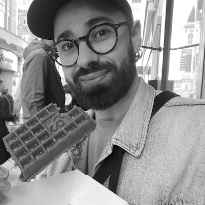

# Damien Ligier, PhD

My research focuses on **Fully Homomorphic Encryption (FHE)** and other **Privicy-Enhencing Technologies (PET)**.
I hold a PhD in Computer Science from CEA & IMT Atlantique where I specialized in practical applications of Functional Encryption (FE). I also earned a Master's degree in Mathematics and Computer Science applied to Cryptology from Université Paris Diderot-Paris 7.

I have more than 6 years of experience in the industry (Zama, Paris & Wallix, Paris) where I had the chance to do research, implement cryptographic primitives, manage engineers and researchers, facilitate the communication between developers and cryptographers and produce internal vulgarization content for learning about FHE.

## 📞 Contact

[LinkedIn](http://linkedin.com/in/damienligier) & [GitHub](https://github.com/damienligier)

## 📃 Publications

#### 2024
- **Faster Secret Keys for (T)FHE**, L. Bergerat, I. Chillotti, D. Ligier, J.-B. Orfila, A. Roux-Langlois, S. Tap, _Modified version to appear at CCS 2024_, [paper](https://eprint.iacr.org/2023/979.pdf).
- **TFHE Simplified: A Practical Guide to Integer Arithmetic and Reliability**, I. Chillotti, S. El Kazdadi, D. Ligier, A. Meyre, T. Montaigu, J.-B. Orfila, S. Tap, _Accepted talk at FHE.org 2024._
    
#### 2023
- **Parameter Optimization & Larger Precision for (T)FHE**, L. Bergerat, A. Boudi, Q. Bourgerie, I. Chillotti, D. Ligier, J.-B. Orfila, S. Tap, _Journal of Cryptology 2023 & accepted talk at FHE.org 2023_, [paper](https://eprint.iacr.org/2022/704.pdf).

#### 2021
- **Improved Programmable Bootstrapping with Larger Precision and Efficient Arithmetic Circuits for TFHE**, I. Chillotti, D. Ligier, J.-B. Orfila, S. Tap, _Asiacrypt 2021_, [paper](https://eprint.iacr.org/2021/729.pdf).
- **Cloud-based Private Querying of Databases by Means of Homomorphic Encryption**, Y. Abbar, P. Aubry, T. Barry, S. Carpov, S. Mallick, M. Krichen, D. Ligier, S. Shpak, R. Sirdey, _IoTBDS 2021._
    
#### 2020
- **CONCRETE: Concrete Operates oN Ciphertexts Rapidly by Extending TfhE**, I. Chillotti, M. Joye, D. Ligier, J.-B. Orfila, _S. Tap, Demo paper at WAHC 2020_, [paper](https://homomorphicencryption.org/wp-content/uploads/2020/12/wahc20_demo_damien.pdf).
- **Illuminating the Dark or how to recover what should not be seen in FE-based classifiers**, S. Carpov, C. Fontaine, D. Ligier, R. Sirdey, _PoPETs 2020_
    
#### 2017
- **Privacy Preserving Data Classification using Inner-product Functional Encryption**, S. Carpov, C. Fontaine, D. Ligier, R. Sirdey, _ICISSP 2017._
- **Information Leakage Analysis of Inner-Product Functional Encryption based Data Classification**, S. Carpov, C. Fontaine, D. Ligier, R. Sirdey, _PST 2017._

## 🎤 Recent Talks
- **An Overview of FHE, TFHE and Concrete Framework**, September 2023 at Cryptography and Coding Theory (Perugia, Italy) with Ilaria Chillotti.
- **Parameter Optimization & Larger Precision for (T)FHE**, June 2023 at Journées Nationales 2023 du GDR Sécurité Informatique (Campus Cyber, Paris, France) with Ilaria Chillotti.
- **Parameter Optimization and Larger Precision for (T)FHE**, March 2023 at FHE.org 2023 with Samuel Tap.
- **Parameter Optimization & Larger Precision for (T)FHE**, March 2023 at the 6th HomomorphicEncryption.org Standards Meeting (Seoul, South Korea) with Ilaria Chillotti.
- **An overview of the Concrete Framework**, September 2022 at the 5th HomomorphicEncryption.org Standards Meeting (Geneva, Switzerland) with Ilaria Chillotti.
- **Improved Programmable Bootstrapping with Larger Precision and Efficient Arithmetic Circuits for TFHE**,
December 2021 at Asiacrypt 2021 with I. Chillotti, J.-B. Orfila and S. Tap.

## 💻 Contribution to Open-Source Projects
- [CONCRETE](https://github.com/zama-ai/concrete)
- [DataPeps](https://github.com/wallix/datapeps-sdk-js)

## 📝 Blogposts
- June 2023, [Parameter Optimization & Larger Precision for (T)FHE](https://www.zama.ai/post/parameter-optimization-and-larger-precision-for-tfhe), with Loris Bergerat, Anas Boudi, Ilaria Chillotti, Quentin Bourgerie, Jean-Baptiste Orfila and Samuel Tap. 
- September 2021, [What’s New in Concrete](https://medium.com/zama-ai/whats-new-in-concrete-aa414d17e535), with Ben Curtis, Ilaria Chillotti, Alexandre Péré

## 🎓 PhD Students
- Loris Bergerat: Intern (2021) and PhD Student (2022 - 2023) - with I. Chillotti and J.-B. Orfila
- Anas Boudi: PhD student (2022 - 2023) - with I. Chillotti and J.-B. Orfila.

## 📚 Teaching
- 2015 to 2018, Teaching Assistant at Université Paris Sud (Orsay, France), lab sessions in:
  - Web Design
  - Database
  - JAVA
  - C++
  - UML
  - Supervision of student projects
